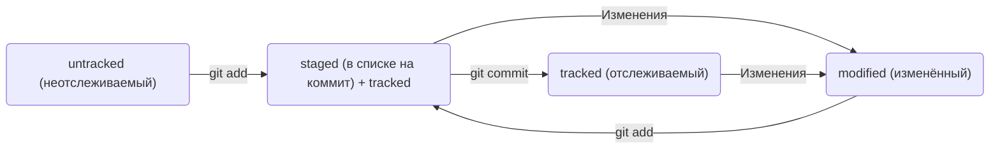

# Создание первого файла README.md и начало работы в Git

## __Базовые команды консоли__  
- pwd (от англ. print working directory, «показать рабочую папку») — покажи, в какой я папке;  
- ls (от англ. list directory contents, «отобразить содержимое директории») — покажи файлы и папки в текущей папке;  
- ls -a — покажи также скрытые файлы и папки, названия которых начинаются с символа .;  
- cd first-project (от англ. change directory, «сменить директорию») — перейди в папку first-project;  
- cd first-project/html — перейди в папку html, которая находится в папке first-project;  
- cd .. — перейди на уровень выше, в родительскую папку;  
- cd ~ — перейди в домашнюю директорию (/Users/Username);  
- cd / — перейди в корневую директорию.

---

## __Работа с файлами и папками__  
### __Создание__  
- touch index.html (англ. touch, «коснуться») — создай файл index.html в текущей папке;  
- touch index.html style.css script.js — если нужно создать сразу несколько файлов, можно напечатать их имена в одну строку через пробел;  
- mkdir second-project (от англ. make directory, «создать директорию») — создай папку с именем second-project в текущей папке.  
### __Копирование и перемещение__  
- cp file.txt ~/my-dir (от англ. copy, «копировать») — скопируй файл в другое место;  
- mv file.txt ~/my-dir (от англ. move, «переместить») — перемести файл или папку в другое место.  
### __Чтение__  
- cat file.txt (от англ. concatenate and print, «объединить и распечатать») — распечатай содержимое текстового файла file.txt.  
### __Удаление__  
- rm about.html (от англ. remove, «удалить») — удали файл about.html;  
- rmdir images (от англ. remove directory, «удалить директорию») — удали папку images;  
- rm -r second-project (от англ. remove, «удалить» + recursive, «рекурсивный») — удали папку second-project и всё, что она содержит.  

---

## __Полезные возможности__  
- Команды необязательно печатать и выполнять по очереди. Можно указать их списком — разделить двумя амперсандами (&&).  
- У консоли есть собственная память — буфер с несколькими последними командами. По ним можно перемещаться с помощью клавиш со стрелками вверх (↑) и вниз (↓).  
- Чтобы не вводить название файла или папки полностью, можно набрать первые символы имени и дважды нажать Tab. Если файл или папка есть в текущей директории, командная строка допишет путь сама.  
- Например, вы находитесь в папке dev. Начните вводить cd first и дважды нажмите Tab. Если папка first-project есть внутри dev, командная строка автоматически подставит её имя. Останется только нажать Enter.

---

## **Создание локальной папки репозитория**  
Чтобы Git начал отслеживать изменения в проекте, папку с файлами этого проекта нужно сделать Git-репозиторием (от англ. repository — «хранилище»). Для этого следует переместиться в неё и ввести команду git init. Не рекомендуется создавать репозиторий Git внутри другого Git-репозитория. Это может вызывать проблемы с отслеживанием изменений.  
Если вы случайно сделали Git-репозиторием не ту папку, её можно «разгитить». Для этого нужно удалить скрытую подпапку .git:

```
$ cd <папка с репозиторием> # перешли в папку

$ rm -rf .git # удалили подпапку .git
```

### Синхронизация локального и удалённого репозиториев.  
git remote add origin https://github.com/YandexPracticum/first-project.git (от англ. remote, «удалённый» + add, «добавить») — привяжи локальный репозиторий к удалённому с URL https://github.com/YandexPracticum/first-project.git;  
git remote -v (от англ. verbose, «подробный») — проверь, что репозитории действительно связались;
git push -u origin main (от англ. push, «толкать») — в первый раз загрузи все коммиты из локального репозитория в удалённый с названием origin.  
git push (от англ. push, «толкать») — загрузи коммиты в удалённый репозиторий после того, как он был привязан с помощью флага -u.  

### Проверить состояние репозитория — git status.  
### Подготовить файлы к сохранению — git add:

```
# подготовили к сохранению все файлы в репозитории:
$ git add --all
$ git status # проверили статус
# можно добавлять файлы по одному:
$ git add todo.txt
$ git add readme.txt
# добавить всю текущую папку:
$ git add .
```

### Выполнить коммит — git commit.  
Сделать коммит можно командой git commit c ключом -m (от англ. message — «сообщение»), который присваивает коммиту сообщение. Сообщение коммита выполняет те же функции — улучшает понимание и упрощает навигацию. Оно пишется после ключа -m в кавычках.

Ещё раз о разнице между git add и git commit:  
Сначала команда git add сообщает Git, какие именно файлы нужно сохранить и какую их версию. Затем с помощью команды git commit происходит само сохранение.

### Просмотреть историю коммитов — git log.  
git log --oneline (от англ. log, «журнал [записей]» + oneline, «одной строкой») — покажет краткую информацию о коммитах: сокращённый хеш и сообщение.  

### Добавление изменений в последний коммит.  
git commit --amend --no-edit (от англ. amend, «исправить») — добавь изменения к последнему коммиту и оставь сообщение прежним;  
git commit --amend -m "Новое сообщение" — измени сообщение к последнему коммиту на Новое сообщение.  
Выйти из редактора Vim: нажать Esc, ввести :qa!, нажать Enter.  

### «Откат» файлов и коммитов.  
git restore --staged hello.txt (от англ. restore, «восстановить») — переведи файл hello.txt из состояния staged обратно в untracked или modified;  
git restore hello.txt — верни файл hello.txt к последней версии, которая была сохранена через git commit или git add;  
git reset --hard b576d89 (от англ. reset, «сброс», «обнуление» + hard, «суровый») — удали все незакоммиченные изменения из staging и «рабочей зоны» вплоть до указанного коммита.  

### Просмотр изменений.  
git diff (от англ. difference, «отличие», «разница») — покажи изменения в «рабочей зоне», то есть в modified-файлах;  
git diff a9928ab 11bada1 — выведи разницу между двумя коммитами;  
git diff --staged — покажи изменения, которые добавлены в staged-файлах.  

---

Чтобы получить доступ к репозиторию на GitHub, вам тоже нужно предоставить ключ, который подтверждает вашу личность и права на чтение или изменение данных. Без этого ключа доступ будет ограничен.
  
## **Что такое SSH.**  
Когда компьютеры обмениваются данными в сети, они следуют сетевым протоколам (англ. network protocols) — правилам обмена данными между компьютерами.  
Один из наиболее распространённых сетевых протоколов — SSH (от англ. Secure Shell Protocol). Он обеспечивает безопасный обмен данными в сети.  
Обычно SSH-ключи находятся в директории .ssh/. Проверить наличие этой директории и файлов в ней можно с помощью следующей команды.

```
$ ls -la .ssh/ # вывели список созданных ключей 
```
Если папка пустая или её нет, всё в порядке.

## __Инструкция по генерации SSH-ключа__  
1. Для генерации SSH-пары можно использовать программу ssh-keygen. Откройте терминал и введите следующую команду.

```
$ ssh-keygen -t ed25519 -C "электронная почта, к которой привязан ваш аккаунт на GitHub" 
```
Используйте электронную почту, к которой привязан ваш GitHub-аккаунт.  
Если вы видите сообщение об ошибке, то, скорее всего, ваша система не поддерживает алгоритм шифрования ed25519. Ничего страшного: используйте другой алгоритм.

```
$ ssh-keygen -t rsa -b 4096 -C "электронная почта, к которой привязан ваш аккаунт на GitHub" 
```
После ввода отобразится такое сообщение.

```
> Generating public/private rsa key pair. # сгенерированы публичный и приватный ключи 
```
2. Укажите место хранения ключей. Простой вариант — сделать домашний каталог пользователя путём по умолчанию. Для этого нажмите Enter. Теперь в указанной директории появится пара ключей.  
3. Программа запросит кодовую фразу (англ. passphrase) для доступа к SSH-ключу. Вы можете оставить поле пустым. Для этого нажмите Enter, а затем ещё раз Enter для подтверждения.  
4. Готово! Теперь осталось проверить, что ключи действительно сгенерировались. Для этого вызовите эту команду.

```
ls -a ~/.ssh 
```

---

## Навигация по коммитам. Статусы файлов.  
### Хеш — идентификатор коммита. 
**Хеширование** (от англ. hash, «рубить», «крошить», «мешанина») — это способ преобразовать набор данных и получить их «отпечаток» (англ. fingerprint).  
Информация о коммите — это набор данных: когда был сделан коммит, содержимое файлов в репозитории на момент коммита и ссылка на предыдущий, или родительский (англ. parent), коммит.  
Git преобразует информацию о коммитах с помощью алгоритма SHA-1 и для каждого из них рассчитывает уникальный идентификатор — хеш.   
Git хранит таблицу соответствий хеш → информация о коммите. Если вы знаете хеш, вы можете узнать всё остальное: автора и дату коммита и содержимое закоммиченных файлов. Можно сказать, что хеш — основной идентификатор коммита.  
Все хеши и таблицу хеш → информация о коммите Git сохраняет в служебные файлы. Они находятся в скрытой папке .git в репозитории проекта.

### Элементы описания коммита и сокращенный log  
После вызова git log появляется список коммитов. Элементы из которых состоит описание коммитов:
- строка из цифр и латинских букв после слова commit — это хеш коммита;
- Author — имя автора и его электронная почта;
- Date — дата и время создания коммита;
- в конце находится сообщение коммита.  

Получить сокращённый лог можно с помощью команды git log с флагом --oneline (англ. «одной строкой»). В терминале появятся только первые несколько символов хеша каждого коммита и их комментарии. Сокращённый хеш (то есть первые несколько символов полного) можно использовать точно так же, как и полный. Для этого команда git log --oneline автоматически подбирает такую длину сокращённых хешей, чтобы они были уникальными в пределах репозитория и Git всегда мог понять, о каком коммите идёт речь.

### Файл HEAD.  
Файл HEAD (англ. «голова», «головной») — один из служебных файлов папки .git. Он указывает на коммит, который сделан последним (то есть на самый новый).  
Внутри HEAD — ссылка на служебный файл: refs/heads/master.  
Если нужно передать последний коммит, то вместо его хеша можно просто написать слово HEAD — Git поймёт, что вы имели в виду последний коммит.

### Статусы файлов в Git.  
- untracked (англ. «неотслеживаемый»):
Новые файлы в Git-репозитории помечаются как untracked, то есть неотслеживаемые. Git «видит», что такой файл существует, но не следит за изменениями в нём. У untracked-файла нет предыдущих версий, зафиксированных в коммитах или через команду git add.
- staged (англ. «подготовленный»):
После выполнения команды git add файл попадает в staging area (от англ. stage — «сцена», «этап [процесса]» и area — «область»), то есть в список файлов, которые войдут в коммит. В этот момент файл находится в состоянии staged.
- tracked (англ. «отслеживаемый»):
Состояние tracked — это противоположность untracked. Оно довольно широкое по смыслу: в него попадают файлы, которые уже были зафиксированы с помощью git commit, а также файлы, которые были добавлены в staging area командой git add. То есть все файлы, в которых Git так или иначе отслеживает изменения.
- modified (англ. «изменённый»):
Состояние modified означает, что Git сравнил содержимое файла с последней сохранённой версией и нашёл отличия. Например, файл был закоммичен и после этого изменён.

#### Жизненный цикл файла в Git



Большинство файлов в проектах «шагает» по следующему циклу: «изменён» → «добавлен в список на коммит» → «закоммичен» → «изменён» → и так далее.  
git status показывает явно следующие состояния файлов: untracked, staged и modified.

### Оформление сообщений к коммитам.
Есть общие рекомендации по тому, как правильно составить сообщение. Оно должно быть:  
- относительно коротким, чтобы его было легко прочитать;
- информативным.

Чтобы упростить работу, команды или даже целые компании часто договариваются об определённом стиле (то есть о правилах) оформления сообщений коммитов.

#### Корпоративный.
Во многих компаниях применяется Jira — система для организации проектов и задач. В корпоративном стиле в начале сообщения обычно указывают Jira-ID, а после — текст сообщения:

```  
$ git commit -m "LGS-239: Дополнить список пасхалок новыми числами" 
```

#### Conventional Commits.
Стандарт Conventional Commits (англ. «соглашение о коммитах») отличается качественной документацией и подробной проработкой. Он подходит для репозиториев с исходным кодом программ.  
Conventional Commits предлагает такой формат коммита: <type>: <сообщение>.  
Первая часть type — это тип изменений. Таких типов достаточно много. Вот два примера:
- feat (сокращение от англ. feature) — для новой функциональности;
- fix (от англ. «исправить», «устранить») — для исправленных ошибок.

#### GitHub-стиль.
GitHub можно использовать не только для хранения файлов проекта, но и для ведения списка задач (англ. issue) этого проекта. Если коммит «закрывает» или «решает» какую-то задачу, то в его сообщении удобно указывать ссылку на неё. Для этого в любом месте сообщения нужно указать #<номер задачи>. Например, вот так:

```  
$ git commit -m "Исправить #334, добавить график температуры"
```

В таком случае GitHub свяжет коммит и задачу.

---

## Работа с ветками.  

### Клонирование чужого репозитория.  
git clone git@github.com:YandexPraktikum/first-project.git (от англ. clone, «клон», «копия») — склонируй репозиторий с URL first-project.git из аккаунта YandexPraktikum на мой локальный компьютер.  

### Создание веток.  
git branch feature/the-finest-branch (от англ. branch, «ветка») — создай ветку от текущей с названием feature/the-finest-branch;  
git checkout -b feature/the-finest-branch — создай ветку feature/the-finest-branch и сразу переключись на неё.  

### Навигация по веткам.  
git branch (от англ. branch, «ветка») — покажи, какие есть ветки в репозитории и в какой из них я нахожусь (текущая ветка будет отмечена символом *);  
git branch -a — покажи все известные ветки, как локальные (в локальном репозитории), так и удалённые (в origin, или на GitHub).  
git checkout feature/br — переключись на ветку feature/br.  

### Удаление веток.  
git branch -d br-name — удали ветку br-name, но только если она является частью main;  
git branch -D br-name — удали ветку br-name, даже если она не объединена с main.  

### Слияние веток.  
git merge main (от англ. merge, «сливать», «поглощать») — объедини ветку main с текущей активной веткой.  
 
### Работа с удалённым репозиторием.  
git push -u origin my-branch (от англ. push, «толкнуть», «протолкнуть») — отправь новую ветку my-branch в удалённый репозиторий и свяжи локальную ветку с удалённой, чтобы при дополнительных коммитах можно было писать просто git push без -u;  
git push my-branch — отправь дополнительные изменения в ветку my-branch, которая уже существует в удалённом репозитории;  
git pull (от англ. pull, «вытянуть») — подтяни изменения текущей ветки из удалённого репозитория.  

---

## Командная работа в Git.  

### Feature branch workflow.  
Самый популярный подход к работе с Git в команде — это feature branch workflow. В нём создают ветку для каждой задачи (например, для новой функциональности или исправления бага), а когда всё готово, вливают новую ветку в main.  
Важные этапы этого процесса — пул-реквест и ревью изменений. Пул-реквест — это интерфейс, в котором можно обсудить изменения. Ревью — просмотр изменений другими участниками и один из способов проверить качество таких изменений.  
Если вы уже участник проекта (или collaborator в терминах GitHub), можно клонировать репозиторий напрямую. А если нет, нужно предварительно сделать «форк». Также для участников доступна кнопка Merge после ревью, а для неучастников — нет.  

### Конфликты слияния.  
Когда один и тот же файл меняется в нескольких ветках, при их слиянии может произойти конфликт. Пугаться конфликтов не нужно, это нормальная часть работы с системами контроля версий. IDE, вроде VSCode или Intellij IDEA, помогут «склеить» файл из двух конфликтующих версий.  

### Алгоритм для создания PR.  
1. Склонировать репозиторий.  
1.1. Если вы не участник проекта, предварительно сделать «форк» исходного репозитория.  
1.2. На странице репозитория или «форка» нажать кнопки: Code → SSH → скопировать ссылку.  
1.3. Выполнить команду git clone <ссылка на репозиторий>.  
2. Создать ветку для вашей задачи: git checkout -b my-task-branch-name.  
3. Добавить и «закоммитить» изменения, которые вы хотите внести в проект.  
4. «Запушить» ветку: git push --set-upstream origin HEAD или git push -u origin my-task-branch-name.  
4.1. GitHub (с помощью Git) выведет ссылку на создание PR. По ней нужно перейти.  
4.2. PR можно также создать через интерфейс GitHub.  
5. Сообщить о пул-реквесте ревьюеру.  
5.1 Иногда ревьюеры назначаются автоматически, тогда сообщать не нужно.  
6. Обсуждать с ревьюером предлагаемые изменения и вносить правки, пока эти изменения не будут одобрены (пока не будет получен «апрув»).  
6.1. Если кто-то добавил конфликтующие изменения в main, пока ваш PR был на ревью, нужно разрешить конфликт:  
   - Обновить main: git checkout main && git pull.  
   - Влить main в свою ветку: git checkout my-task-branch-name && git merge main.  
   - Разрешить конфликты слияния с помощью IDE или вручную.  
   - Создать коммит слияния: git commit --no-edit или git commit -m 'merge main'.  
   - Сделать git push своей ветки.  
7. Нажать кнопку Merge или подождать, пока её нажмёт кто-то ещё.  
8. Ещё раз обновить main, чтобы «подтянуть» ваши изменения в основную ветку локального репозитория: git checkout main && git pull.  
9. Вы великолепны! Можете начинать снова со второго пункта.  

### Алгоритм для разрешения конфликтов слияния.  
1. Открыть проект в IDE (VS Code, IDEA или другие).  
2. Открыть файл, в котором есть конфликт.  
3. Выбрать, какие части файла нужно взять из одной ветки, а какие — из другой.  
4. Когда конфликты разрешены, сделать коммит: git commit --no-edit или git commit -m 'merge branch <название ветки>'.  

---

## Шпаргалка markdown

### Выделение текста

Вы можете выделять текст в markdown с помощью символов `_` или `*`. Например:

Пример _курсива_ (*курсива*) и **жирного** (__жирного__) текста.

## Заголовки

Заголовки можно создавать с помощью символа `#`. Чем больше `#`, тем меньше заголовок. Например:

# Заголовок первого уровня
## Заголовок второго уровня
### Заголовок третьего уровня

## Выделение кода

Чтобы выделить текст как код, поместите его в тройные кавычки `````. 

```
mkdir my_project
cd my_project
git init
```
Это лишь некоторые функции markdown.
